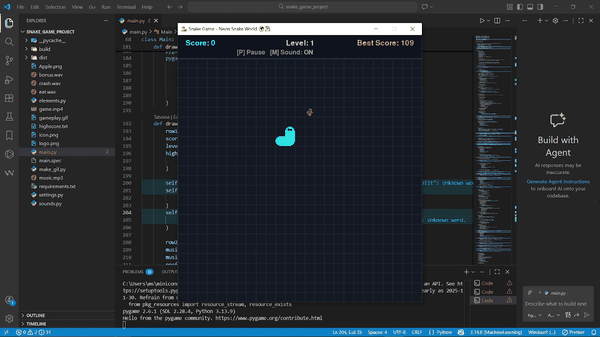

# 🌍🐍 Neon Snake World: Engineered for Performance



**A modern, object-oriented re-imagining of the classic Snake game,
built with Python and Pygame.**

This project is not just a game; it is a demonstration of **Clean Code**
principles, **Modular Architecture**, and **Game Loop Optimization**. It
features a robust particle system, dynamic difficulty scaling, and a
polished UI with neon aesthetics.

------------------------------------------------------------------------

## 🚀 Key Features

### 🛠️ Software Architecture

-   **Modular OOP Design:** The codebase is split into logical modules
    (`logic`, `assets`, `settings`) to ensure scalability and
    maintainability.
-   **Event-Driven Input Handling:** Responsive controls decoupled from
    the rendering loop.
-   **Resource Management:** Efficient loading and handling of sprites
    and audio via a dedicated `SoundManager` class.

### ✨ Visuals & Polish (Game Juice)

-   **Fluid Rendering:** Smooth movement and rendering at a locked 60
    FPS.
-   **Particle System:** Custom-built particle engine for feedback
    effects (e.g., eating apples, bonus items).
-   **Screen Shake:** Impact feedback algorithm for collisions (Game
    Over state).
-   **Dynamic Theming:** Background colors evolve progressively based on
    the player's score to maintain visual interest.
-   **Neon UI:** Glowing text effects and modern HUD design.

### 📦 Deployment

-   **Standalone Executable:** Compiled using `PyInstaller` for easy
    distribution on Windows without requiring a Python installation.
-   **System Integration:** Custom app ID and taskbar icon integration
    via `ctypes`.

------------------------------------------------------------------------

## 📂 Project Structure

``` text
📁 Neon-Snake-World/
│
├── 📄 main.py          # Entry point. Manages the Game Loop, State Machine, and Rendering Pipeline.
├── 📄 elements.py      # Entity classes (Snake, Fruit, Particles) containing logic and draw methods.
├── 📄 settings.py      # Centralized Configuration (Constants, Colors, Game Physics).
├── 📄 sounds.py        # Audio Manager for handling SFX and Background Music safely.
├── 📄 highscore.txt    # Persistent local storage for player records.
└── 📁 assets/          # Images and Sound files.
```

------------------------------------------------------------------------

## 🛠️ Installation & Setup

If you want to run the source code directly:

### 1️⃣ Clone the repository

``` bash
git clone https://github.com/Eng-AhmedAyman/Neon-Snake-World.git
```

### 2️⃣ Install dependencies

``` bash
pip install pygame
```

### 3️⃣ Run the game

``` bash
python main.py
```

------------------------------------------------------------------------

## 🎮 Controls

  Key          Action
  ------------ ----------------------
  Arrow Keys   Move the Snake
  P            Pause / Resume Game
  M            Mute / Unmute Sound
  SPACE        Start / Restart Game
  ESC          Return to Menu

------------------------------------------------------------------------

## 👨‍💻 Author

**Ahmed Ayman** - AI & Data Science Engineer\
Passionate about bridging the gap between efficient algorithms and
interactive visual experiences.

Enjoy the Neon World! 🕹️
